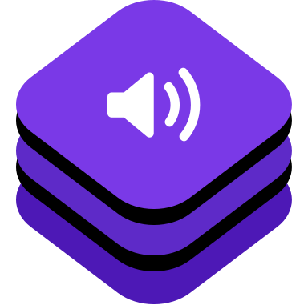

# TSKit

![badge-languages] ![badge-pms]




TSKit is a Objective-C wrapper around the [C TeamSpeak client library](https://www.teamspeak.com/en/downloads/)

Note: This is still work in progress.

# Installation

## Carthage
[Carthage](https://github.com/Carthage/Carthage) is a decentralized dependency manager that builds your dependencies and provides you with binary frameworks.

You can install Carthage with [Homebrew](http://brew.sh/) using the following command:

```bash
$ brew update
$ brew install carthage
```

To integrate Alamofire into your Xcode project using Carthage, specify it in your `Cartfile`:


```ogdl
# Cartfile

github "JanC/TSKit"
```

Run `carthage update` to build the framework and drag the built `TSKit.framework` into your Xcode project.


# Usage

### Connect

```swift
class SampleViewController: UIViewController {

    
    override func viewDidLoad() {
        
    // Connection options
    let options = TSClientOptions(host: "localhost",
                                  port: 9986,
                                  nickName: "Jan",
                                  password: nil,
                                  receiveOnly: true) // no transmission will be made. This also does not trigger the microphone permissions
    
    let client = TSClient(options: options)
    
    // set the delegate to respond to server events
    client.delegate = self
    
    // You can optionally supply a initial channel to join upon connection
    client.connect(initialChannels: ["MyChannel"], completion: nil)
    }
}
```

### Delegate
```swift
extension SampleViewController: TSClientDelegate {
    
    func client(_ client: TSClient, user: TSUser, talkStatusChanged talking: Bool) {
        print("\(user.name) is talking \(talking)")
    }
    
    func client(_ client: TSClient, didReceivedChannel channel: TSChannel) {
        print("New channel created: \(channel.name)")
    }
    func client(_ client: TSClient, didDeleteChannel channelId: UInt) {
        print("Channel removed: \(channelId)")
    }
    
    func client(_ client: TSClient, connectStatusChanged status: TSConnectionStatus) {
        switch status {
        case .disconnected:
            print("Connection disocnnected")
            break;
        case .connecting:
            print("Connection connecting")
            break;
        case .connected:
            print("Connection connected")
            break;
        case .establishing:
            print("Connection establishing")
            break;
        case .established:
            print("Connection established")
            break;
        }
    }
    
    func client(_ client: TSClient, onConnectionError error: Error) {
       // we were disconnected
    }
}
```

[badge-languages]: https://img.shields.io/badge/languages-Swift%20%7C%20ObjC-orange.svg
[badge-pms]: https://img.shields.io/badge/supports-CocoaPods%20%7C%20Carthage-green.svg


# Development

## Test Server & Client
To run a local SDK server and client for debugging purposes, [download the SDK](https://teamspeak.com/en/downloads/#sdk) into to `tools` directory and build & run the examples

**Download SDK**

```bash
cd tools
curl -O https://files.teamspeak-services.com/releases/sdk/3.0.4.4/ts3_sdk_3.0.4.4.zip
unzip ts3_sdk_3.0.4.4.zip
ln -s ts3_sdk_3.0.4.4 ts3_sdk

**Server**

```bash
cd tools/server/
make
./ts3_server_sample 
```

**Client**

```bash
cd tools/client
make
# ip port password receiveonly clientname
./ts3_client_sample localhost 9986 1234 0 client-term
```


## Library
The `TSKit` uses a compiled "fat" `libts3client.a` static library that is included in the downloaded zip. In order to merge all the architectures for both the iOS Simulator and the device:

```bash
cd ts3_sdk_3.0.4/lib/ios
lipo -create device/libts3client.a simulator/libts3client.a -output  libts3client.a
```

The result is 

```bash
file libts3client.a 
libts3client.a: Mach-O universal binary with 5 architectures: [i386: Mach-O object i386] [x86_64] [arm_v7] [arm_v7s] [arm64]
libts3client.a (for architecture i386):	Mach-O object i386
libts3client.a (for architecture x86_64):	Mach-O 64-bit object x86_64
libts3client.a (for architecture armv7):	Mach-O object arm_v7
libts3client.a (for architecture armv7s):	Mach-O object arm_v7s
libts3client.a (for architecture arm64):	Mach-O 64-bit object arm64
```


